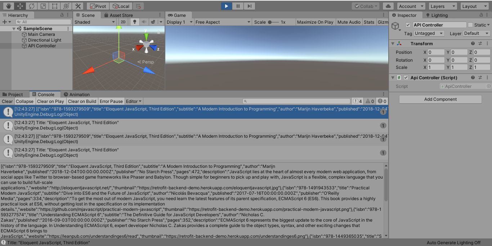

# API Demo Unity 3D

Example project for calling apis using WWW and UnityWebRequest classes.

## Code

```cs

    void Start() {
        string url = "https://retrofit-backend-demo.herokuapp.com/book";
        StartCoroutine(GetBooksUsingWWW(url));
        StartCoroutine(GetBooksUsingUnityWebRequest(url));
    }

    IEnumerator GetBooksUsingWWW(string url) {
        using (WWW www = new WWW(url)){
            yield return www;
            Debug.Log(www.text);
            JSONNode jsonNode = JSON.Parse(www.text);
            string title = jsonNode[0]["title"].ToString();
            Debug.Log("Title: " + title);
        }
    }

    IEnumerator GetBooksUsingUnityWebRequest(string url) {
        UnityWebRequest www = UnityWebRequest.Get(url);
        yield return www.SendWebRequest();
 
        if(www.isNetworkError || www.isHttpError) {
            Debug.Log(www.error);
        }
        else {
            Debug.Log(www.downloadHandler.text);
            JSONNode jsonNode = JSON.Parse(www.downloadHandler.text);
            string title = jsonNode[0]["title"].ToString();
            Debug.Log("Title: " + title);
        }
    }

```

## Screenshots


## Requirements

* Unity 2019.4.17f1
* [SimpleJSON](SimpleJSON.unitypackage) 